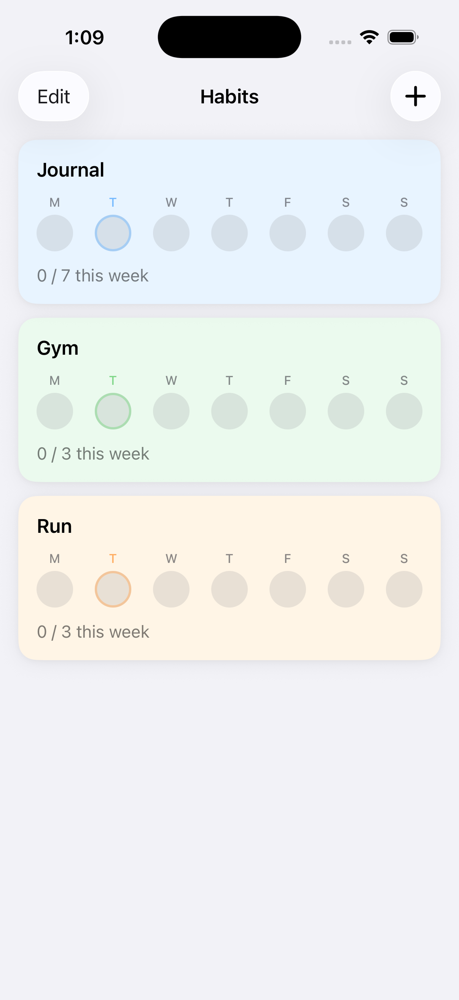

# Habits

A beautiful, minimal habit tracker for iOS that helps you build consistency through weekly goals.

<p align="center">
  
</p>

## Features

- **Weekly Goals** — Set a target for how many days per week you want to complete each habit
- **Visual Progress** — See your week at a glance with intuitive circle indicators
- **Tap to Complete** — Mark any day as complete with a single tap, even past days
- **Color Coding** — Personalize each habit with 8 beautiful pastel colors
- **Reorder Habits** — Drag and drop to organize your habits however you like
- **Goal Celebrations** — Satisfying animations when you hit your weekly target
- **Haptic Feedback** — Subtle haptics make interactions feel great

## Requirements

- iOS 17.0+
- Xcode 15.0+

## Getting Started

1. Clone the repository
2. Open `Habits.xcodeproj` in Xcode
3. Select your development team in Signing & Capabilities
4. Build and run on simulator or device

## Tech Stack

- **SwiftUI** — Declarative UI framework
- **SwiftData** — Persistence and data modeling
- **Swift Observation** — Reactive state management

## Project Structure

```
Sources/
├── App/
│   └── HabitsApp.swift
├── Models/
│   ├── Habit.swift
│   ├── Completion.swift
│   └── HabitColor.swift
├── ViewModels/
│   ├── HabitListViewModel.swift
│   └── HabitDetailViewModel.swift
├── Views/
│   ├── HabitListView.swift
│   ├── HabitCardView.swift
│   ├── HabitDetailView.swift
│   ├── AddHabitSheet.swift
│   ├── WeekIndicatorView.swift
│   └── ColorPickerGrid.swift
├── Components/
│   └── AnimationConstants.swift
└── Utilities/
    ├── DateHelpers.swift
    └── HapticManager.swift
```

## License

MIT
